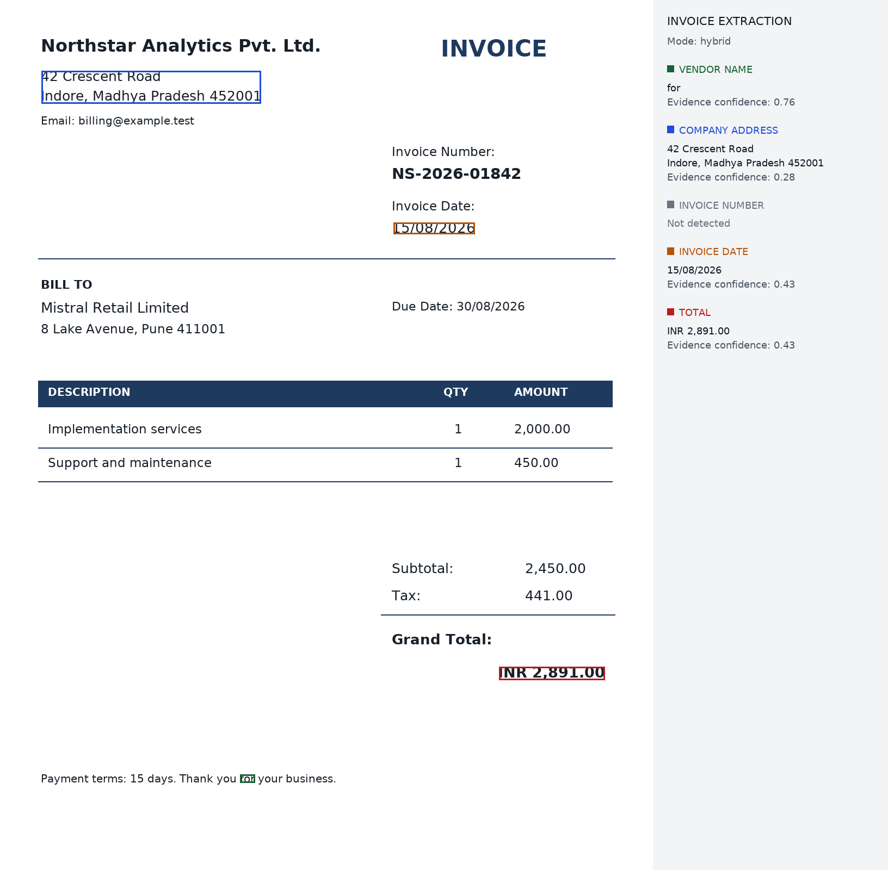
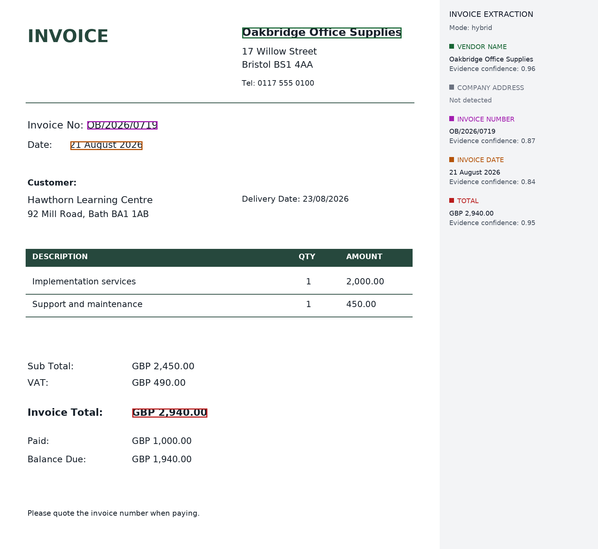
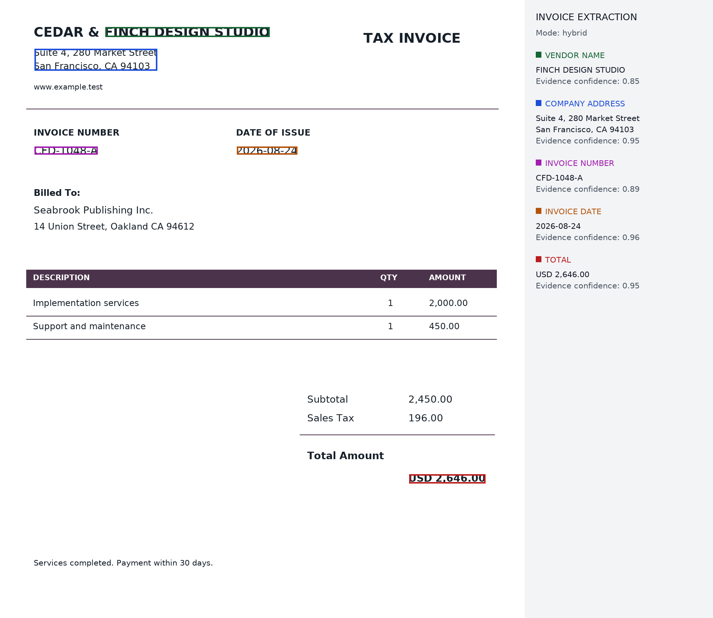
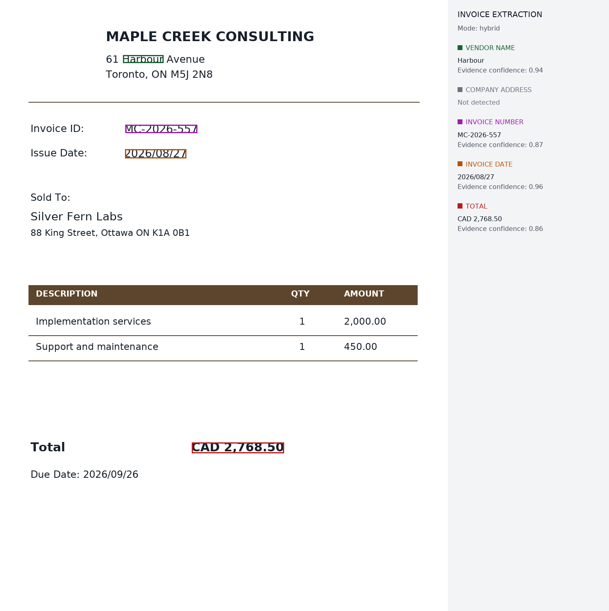
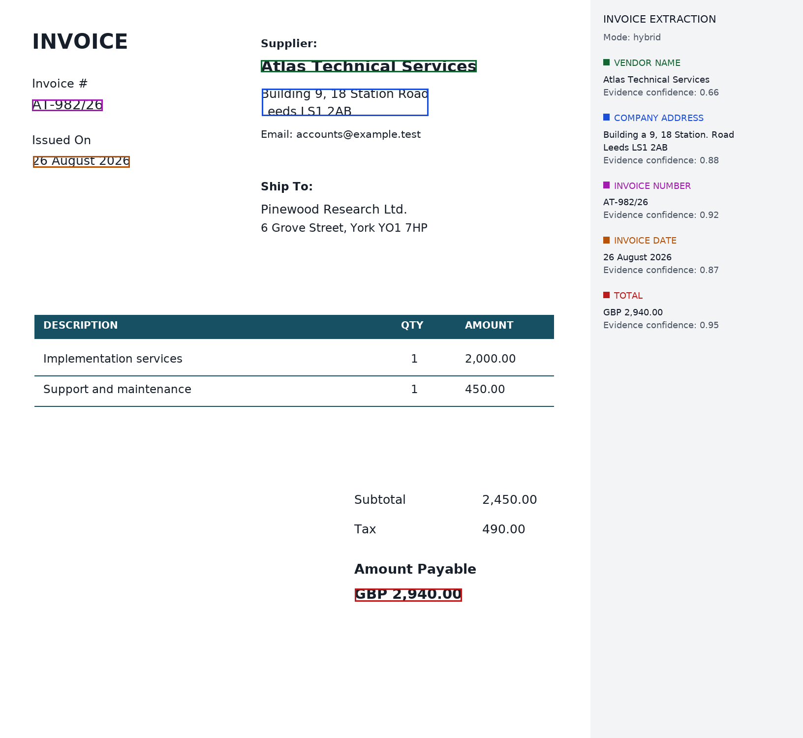
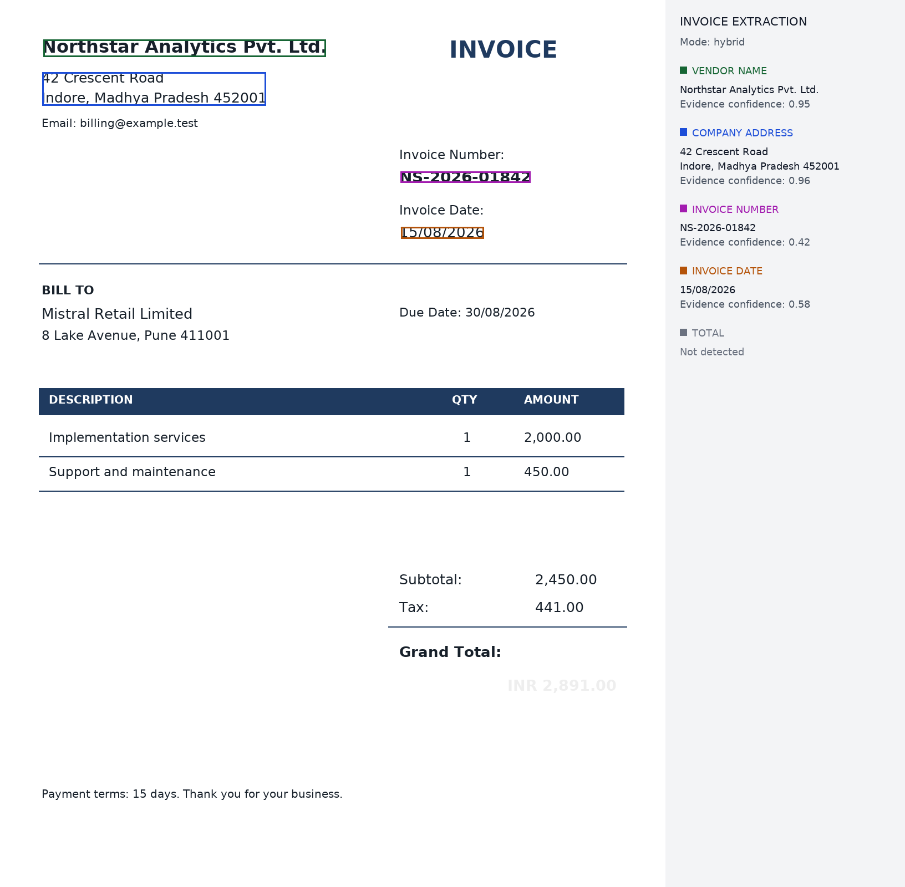
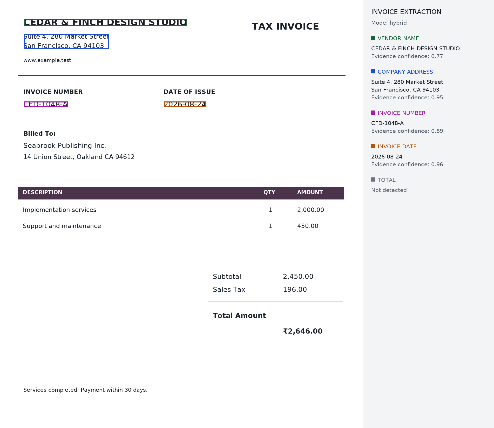

# Error analysis

These are actual runs, including unresolved failures. All invoices are synthetic;
the test set is deliberately small. Original outputs and traces are retained so
the observations can be checked, rather than replaced by corrected screenshots.

## 1. A footer word became the vendor name

**Run:** original public checkpoint, initial aggregation.

- **Predicted:** vendor name `for`; invoice number `null`.
- **Expected:** `Northstar Analytics Pvt. Ltd.` and `NS-2026-01842`.
- **Root cause:** the checkpoint labelled a footer word as a vendor and table
  quantities as invoice numbers. The original ranking let high model confidence
  dominate the actual invoice-number key. Two quantities then tied and caused
  abstention.
- **Implemented fix:** exclude common footer words, reject single-digit quantities
  and comma-formatted amounts as identifiers, prefer explicit metadata keys, and
  perform the documented small supervised adaptation. The final development run
  extracts all five fields from this invoice correctly.

[Original JSON](samples/error_analysis/initial/classic.json) ·
[Original trace](samples/error_analysis/initial/classic.trace.json) ·
[Final output](samples/output/classic.png)

## 2. A phone line poisoned an otherwise complete address

**Run:** adapted model, before the address-continuation repair.

- **Predicted:** company address `null`.
- **Expected:** `17 Willow Street` followed by `Bristol BS1 4AA`.
- **Root cause:** the model also labelled the following telephone line as an
  address. The merger included that line, then the contact-text filter rejected
  the whole candidate. The two remaining address lines had nearly equal scores
  and were incorrectly treated as independent alternatives.
- **Implemented fix:** validate individual lines before combining multi-line
  candidates and prefer an accepted complete span over its shorter fragments.
  The telephone line is excluded; the final value has a union box and two line boxes.

[Original trace](samples/error_analysis/adapted_initial/right_header.trace.json) ·
[Final output](samples/output/right_header.png)

## 3. An uncertain ampersand truncated the legal name

**Run:** adapted model, before the interior-word repair.

- **Predicted:** `FINCH DESIGN STUDIO`.
- **Expected:** `CEDAR & FINCH DESIGN STUDIO`.
- **Root cause:** the model assigned `&` a higher address probability than name
  probability. It retained name support of about 0.224, but the first version
  only bridged words whose winning class was below the seed threshold.
- **Implemented fix:** a single interior word can bridge matching neighbours when
  its support for their field is at least 0.15 and OCR confidence is at least 0.15.
  Its uncertainty still reduces the output confidence. The final name is complete.

[Original trace](samples/error_analysis/adapted_initial/ledger.trace.json) ·
[Final output](samples/output/ledger.png)

## 4. A new centered header caused name/address confusion

**Run:** first untouched-layout evaluation, code commit `4846c29`.

- **Predicted:** vendor `Harbour`; address `null`.
- **Expected:** `MAPLE CREEK CONSULTING`; `61 Harbour Avenue` followed by
  `Toronto, ON M5J 2N8`.
- **Root cause:** a highly confident name prediction on a street-name fragment
  outranked the geometric header candidate. Name/address overlap also affected
  selection. The centered arrangement was outside the small training layouts.
- **Implemented fix after inspection:** reject a vendor candidate that is a
  fragment of a postal-address line, remove non-postal leading address lines,
  and prefer complete measured spans. The post-review rerun is reported
  separately in `VALIDATION.md`; it is not presented as a new held-out score.
  The final centered-header rerun now extracts both fields correctly.

[Original trace](samples/heldout/output/centered.trace.json) ·
[Post-review output](samples/review/output/centered.png)

## 5. Correct address box, incorrect OCR characters

**Run:** first untouched-layout evaluation, sidebar layout.

- **Predicted:** `Building a 9, 18 Station. Road` followed by `Leeds LS1 2AB`.
- **Expected:** `Building 9, 18 Station Road` followed by `Leeds LS1 2AB`.
- **Root cause:** OCR inserted characters/punctuation. The field box was close to
  the ground truth (IoU about 0.988), but the raw field string was wrong. A good
  box score alone would hide this failure.
- **Proposed fix:** retry recognition on the field crop using a second OCR
  configuration, retain both raw readings, and compare their evidence. An
  address dictionary should not silently overwrite OCR. This case remains a
  useful limit of the current single-pass OCR path.

[OCR and prediction trace](samples/heldout/output/sidebar.trace.json)

## 6. Very faint total disappears from OCR

- **Predicted:** total `null`.
- **Expected:** `INR 2,891.00`.
- **Root cause:** the low-contrast printed total did not yield a usable OCR value.
  The subtotal and tax remained readable, but they are different fields.
- **Proposed fix:** add a bounded contrast/thresholding retry and compare OCR
  confidence. Keep null when no text is recovered; do not substitute subtotal or
  invent the total from arithmetic.

[Original JSON](samples/stress/output/faint_total.json) ·
[Original trace](samples/stress/output/faint_total.trace.json)

## 7. Currency-glyph recognition

- **Predicted:** total `null` on the rupee-glyph stress fixture.
- **Expected:** `₹2,646.00`.
- **Root cause:** English OCR read the amount as `%2,646.00`, with word confidence
  0.47. The leading `%` is incompatible with the amount parser, so the candidate
  was rejected. The model cannot reliably restore the missing rupee symbol.
- **Proposed fix:** compare a currency-aware OCR configuration or field-crop
  recognizer, keeping normalization separate from the original text. A bare
  currency-looking glyph should not be replaced based only on page geography.

[OCR trace](samples/stress/output/rupee_symbol.trace.json)

## What the failures say about scope

The main remaining weaknesses are OCR quality and unfamiliar issuer/address
arrangements. The current synthetic fixtures cannot establish performance on
real vendor documents. The next useful experiment is a vendor-disjoint real
invoice set with explicit field labels, followed by OCR retries and confidence
calibration. The regression tests protect the concrete grouping/box failures
already found here; they do not justify a claim of universal accuracy.
