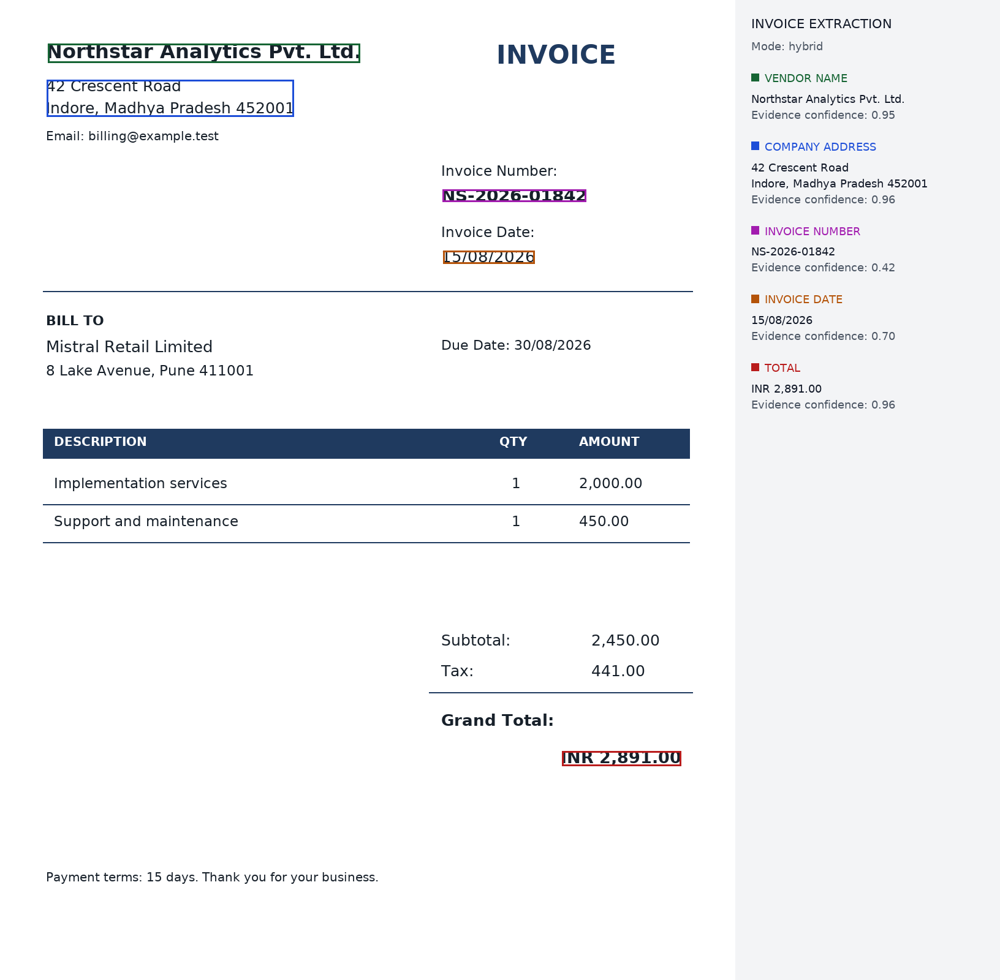

# Invoice field extraction with LayoutLMv3

A command-line extractor for five invoice fields: issuer name, issuer address,
invoice number, issue date, and grand total. Each detected value has one merged
pixel-space box. Missing or unresolved fields stay `null`.

The pipeline runs Tesseract, a locally adapted LayoutLMv3 classifier, and a
documented aggregation layer. `--debug` records the OCR, model scores, candidate
values, rejection reasons, and selected evidence. Rule-based corrections are
explicit and can be disabled.

## 1. Setup

Use Python **3.12** and Tesseract **5**. A CPU is sufficient for inference. The
first model download is approximately **504 MB**; subsequent runs use the cache.
The repository includes a **28.4 MB** adaptation, not the base model weights.

### Install Tesseract

**Windows:** install the 64-bit build linked from the
[Tesseract Windows instructions](https://github.com/UB-Mannheim/tesseract/wiki),
including English language data. Add its directory to `PATH`, or supply the
executable explicitly with `--tesseract-cmd`.

**Ubuntu/Debian:**

```bash
sudo apt-get update
sudo apt-get install tesseract-ocr tesseract-ocr-eng
```

Check the executable:

```bash
tesseract --version
```

### Install Python packages

Run these commands from the repository root:

```bash
python -m venv .venv
```

Activate it with `.venv\Scripts\Activate.ps1` in Windows PowerShell, or
`source .venv/bin/activate` on Linux/macOS. Then:

```bash
python -m pip install -r requirements.txt
```

For tests, install `requirements-dev.txt` instead. CUDA is optional; a compatible
CUDA build of the pinned PyTorch version can be used for GPU execution. The
ordinary dependency installation also supports the documented CPU command.

Pinned direct dependencies are in `requirements.txt`. A full tested environment
lock and the final verification results are recorded in `VALIDATION.md`.
The final pre-submission checks and the reproducible 20-case audit command are
documented in [FINAL_AUDIT.md](FINAL_AUDIT.md).

## 2. How to run inference

The assignment's command contract works directly:

```bash
python predict.py --input samples/input/classic.png --output result.jpg --json result.json
```

To force CPU execution and save the decision trace:

```bash
python predict.py --input samples/input/right_header.png --output result.png --json result.json --debug result.trace.json --device cpu
```

If Tesseract is not on `PATH`, append `--tesseract-cmd "path/to/tesseract.exe"`.
The annotated image contains the original invoice at `(0, 0)` and a side legend.
The legend is outside the invoice, so labels cannot cover extracted values.

| Option | Behaviour |
|---|---|
| `--mode hybrid` | Default: real model predictions plus key/layout candidates. |
| `--mode model` | Model candidates only, with the same cleanup and conflict checks. |
| `--mode heuristic` | Explicit diagnostic mode; no model runs, and JSON says so. |
| `--adapter none` | Disable this project's adaptation and test the original public checkpoint. |
| `--model PATH` | Use an already-downloaded base checkpoint directory. The adaptation verifies its SHA-256. |
| `--local-files-only` | Fail clearly if the requested model files are not already available. |
| `--rotate 90` | Rotate clockwise for recognition, then map output boxes back to original pixels. Also accepts 0/180/270. |
| `--input invoice.pdf` | Rasterize **page 1 only** at 150 DPI; JSON dimensions/boxes refer to that raster. |
| `--pdf-dpi 200` | Change PDF rasterization resolution, within 72–600 DPI. |
| `--psm 11` | Try sparse-text OCR; the tested default is Tesseract PSM 3. |

Input, output, JSON, and trace paths must be distinct. Blank pages produce five
null fields and a readable annotated image. Missing dependencies, unreadable
inputs, or missing model files return a nonzero exit code with an explanation;
the program does not silently substitute a different model.

## 3. Model

### Checkpoint and local adaptation

The base is
[`Kapilydv6/layoutlmv3-invoice-parser`](https://huggingface.co/Kapilydv6/layoutlmv3-invoice-parser),
pinned to revision `e464cfcadf6b766e105119c46e06f81ff1e4836a`. Its published labels
include all five requested fields, but the initial local runs showed weak
predictions. Those original outputs are retained in `samples/error_analysis/initial`.

I adapted the final encoder block and a new six-label classifier on **36 generated
training invoices**, using **eight separate validation invoices** to select the
epoch. The other encoder blocks and embeddings were frozen. The training data
vary issuer identities, addresses, dates, identifier formats, totals, font sizes,
and geometry across four layout arrangements. The development examples and
held-out layout fixtures are separate invoice identities.

- **Labels:** flat `O`, `VENDOR_NAME`, `VENDOR_ADDR`, `INVOICE_NUM`, `INVOICE_DATE`, `TOTAL`.
- **Why flat labels:** the task needs one value per field; geometry and explicit
  candidate boundaries handle separation. This avoids depending on fragile BIO
  transitions when OCR splits an identifier. The original BIO checkpoint can
  still be evaluated with `--adapter none`.
- **Trainable parameters:** 7,092,486; final block plus classification head.
- **Training:** 12 epochs, batch size 1, AdamW; encoder learning rate `2e-5`,
  classifier learning rate `5e-4`, weight decay `0.01`, gradient clipping `1.0`.
- **Loss:** weighted cross-entropy; `O=0.35`, name/address `1.0`, other fields `1.4`.
  Only the first subtoken of each OCR word is supervised; other positions are ignored.
- **Runtime:** 62.53 seconds including OCR preparation, on an RTX 4050 Laptop GPU.
- **Selection:** epoch 12, validation field-token macro-F1 **0.9720**. This is a
  small synthetic validation result, not an estimate of production accuracy.

`assets/adaptation/config.json` records labels, base identity, selected epoch,
seed, tensor names, and validation confusion counts. `training_report.json`
contains every epoch. The adapter uses safe tensor serialization and contains
only the trained tensors; the base weights are not committed.

To reproduce the data and training:

```bash
python scripts/generate_training.py --seed 1729
python train.py --tesseract-cmd "path/to/tesseract" --epochs 12 --device cuda
```

Use `--device cpu` if needed; training will take longer. Small numerical
differences across PyTorch builds or devices can change the selected epoch.
No large model was trained from scratch. The public checkpoint's original
training dataset size is not reported by its author, so no unsupported claim
about that dataset is made here.

### What reaches LayoutLMv3

Tesseract supplies words and original pixel boxes. Boxes are clipped to the page
and mapped to `[0, 1000]` with `int(1000*x/width)` and the analogous y formula.
The image processor resizes the RGB image to 224×224 and uses mean/std 0.5.
The processor's OCR is disabled, avoiding a second incompatible word sequence.

The fast tokenizer maps subtokens back to OCR word indices. Inference uses
512-token windows with 96-token overlap. Special/padding tokens and continuation
subtokens are excluded; first-subtoken probability vectors for the same word
are averaged across windows. An explicit check ensures every OCR word has a
prediction, including words beyond the first window. The model returns text
token labels, not pixel coordinates, so output boxes are recovered through the
original OCR word identities.

## 4. OCR engine

Tesseract runs locally, needs no API key, and provides measured word boxes,
confidence values, and character geometry through hOCR. Its main weaknesses
here are faint print, unfamiliar currency glyphs, and unusual page layouts;
recognition mistakes remain visible in the raw output rather than being corrected
to an invented value. PSM 3 is the default; explicit right-angle rotation is
supported, while automatic deskew and handwriting are outside the tested scope.

The hOCR parser converts word confidence from 0–100 to 0–1. No OCR word is
silently discarded at import. Character boxes are retained when their count
matches the recognized word, which lets the aggregation layer separate
`Total:₹52,450.00` into a key and a tightly bounded value.

## 5. Token-to-field merging

This is the main design component. The sequence is:

```text
OCR words -> visual rows -> separate text segments
          -> model candidates + optional key/layout candidates
          -> trim keys and stitch values
          -> reject incompatible evidence
          -> rank / abstain / select one candidate
          -> merge measured pixel boxes
```

### 5.1 Reading order and adjacency

Words join a visual row when their vertical overlap is at least **0.5** and their
centre distance is at most **0.6 times** the larger text height. Rows are ordered
top to bottom, then words left to right. A horizontal gap larger than **three
median word heights** starts a new segment. This prevents an issuer on the left
from merging with an invoice heading or buyer name on the right.

These thresholds scale with text height rather than vendor-specific pixel
coordinates. No issuer identity or fixed invoice template is used by extraction.
Fixed positions appear only in fixture generators, where they describe artwork.

### 5.2 Model candidates and uncertain words

A word seeds a model candidate if the winning label is a target field, that
field's probability is at least **0.50**, and OCR confidence is at least **0.15**.
Adjacent matching words in a segment join the same candidate. For the optional
original BIO checkpoint, repeated `B-` tags inside an adjacent same-field segment
are repaired and recorded in the trace.

A single uncertain interior word may bridge two matching field predictions when
its field probability is at least **0.15** and its OCR confidence is at least
**0.15**. This avoids dropping a weak middle word from an otherwise coherent name.
The lower-confidence word still reduces the field's confidence.

For issuer names and addresses, aligned successive lines can form a multi-line
candidate. The maximum gap is **1.8 text heights**, with left-edge tolerance of
**two heights**; the limits are two lines for a name and four for an address.

### 5.3 Explicit heuristic candidates

Address continuation also checks nearby contact evidence across segment breaks.
If a continuation fragment has no postal evidence and a contact segment starts
within four times the larger segment text height on the same row, continuation
stops. This handles damaged OCR labels separated from their email address without
blocking explicit postal lines or distant contact columns.

Hybrid mode also looks for field keys such as `Invoice Number`, `Issue Date`,
`Grand Total`, and `Supplier`. Longer key matches take precedence. Negative keys
such as `Sub Total`, `Balance Due`, `Tax`, and `Due Date` mask overlapping positive
matches, so the word `Total` inside `Sub Total` does not create a grand-total key.

Values may follow a key on the same row or occupy a nearby row below it. A
same-row candidate stops at the next recognized key. A below-key candidate must
be within **2.2 text heights** and aligned to the key's column; structured values
may be right-aligned within a bounded extension of that column.

Without an explicit seller key, an upper-page multi-word name is considered only
when a plausible postal address directly follows it. Address continuation stops
at a new field/buyer label, contact information, a large gap, a column shift, or
four lines. These are fallbacks, recorded as `heuristic` or `hybrid` evidence.

### 5.4 Key removal and split/merged OCR tokens

Key matching uses character offsets into the OCR words. Only the value slice is
retained. If a fused key/value word has character boxes, the output rectangle is
the union of the value's actual character boxes. If alignment is unavailable,
the full measured word box is retained and `approximate_box: true` is recorded
in the trace; proportional character widths are not presented as measured boxes.

Subtokens are never concatenated as independent OCR words. OCR word pieces are
joined in reading order. For identifiers, dates, and amounts, punctuation rules
and small observed gaps join fragments such as `INV-2026` and `-00125` without
an extra space. Multi-line values preserve `\n`. The string's characters remain
the OCR result; only stitching separators and key removal change the assembly.

### 5.5 Conflict resolution and abstention

Before ranking, candidates must fit the field's syntax. Dates must be plausible;
amounts must have numeric/currency syntax; invoice identifiers must not be
single-digit quantities or comma-formatted monetary values. Common footer words
cannot independently be issuer names. Candidates in labelled buyer blocks are
rejected for issuer fields. A structured value beside an incompatible key is
rejected even if the model is confident.

Let `M` be character-count-weighted model support and `O` the similarly weighted
OCR confidence. The starting rank is `0.55*M + 0.25*O + 0.20`. A recognized key of
strength `A` can raise this to `0.58 + 0.18*A + 0.15*O + 0.09*M`. Strong keys have
`A=1`; generic `Date` uses `0.75`, generic `Total` uses `0.8`, and seller keys use
`0.95`. Unkeyed structured candidates are capped at **0.86** so a very confident
table quantity cannot outrank explicit invoice metadata. Unkeyed heuristic
candidates use `0.57 + 0.20*O + 0.10*M`. A multi-line address gets a **0.035**
completeness preference; ranks are capped at `0.999`.

Candidates with mean OCR confidence below **0.35** or rank below **0.68** are
rejected. Duplicates from different evidence paths are deduplicated by OCR word
and character span. Remaining ties prefer more complete candidates and then
reading order. If two independent candidates differ in rank by less than
**0.03** and have equal key strength, the field is left null. Selection also
prevents the same character span from filling two different fields.

A model name that is only a fragment of a postal-address line is rejected.
Non-postal leading lines are removed from a multi-line address candidate before
ranking. Two aligned name lines followed by a postal address can form a complete
seller-name candidate. For an already admitted name/address span with mean OCR
confidence at least **0.80**, a complete candidate gets rank at least **0.015**
above its accepted shorter fragments. This preference uses existing measured
text only. It addresses a failure observed after the first held-out evaluation;
the original held-out scores and subsequent regression results are kept separate.

### 5.6 Confidence and bounding boxes

For a model result, field confidence is the character-count-weighted mean of
`OCR confidence * field probability`. For a result supported by rules, it is
`O * (0.55*M + 0.45*A)`; unkeyed geometric fallback uses `A=0.65`. This is an
**uncalibrated evidence score**, not a guaranteed probability of correctness.
Selection rank and output confidence have different purposes and are both
visible in the trace.

The primary box is `[min(x1), min(y1), max(x2), max(y2)]` over the selected
measured value boxes. It is one integer rectangle in the original image's pixel
space, with the origin at the upper-left. Multi-line values also emit `line_boxes`.
A single rectangle necessarily includes whitespace between lines; the line boxes
show the tighter extent and make that tradeoff explicit. Labels appear in a
side legend, and exactly one primary rectangle is drawn per field.

The original pixel boxes are retained throughout processing. Using them for the
final union avoids the rounding loss of converting model input coordinates back
from 0–1000. `merge.py` includes the inverse normalization for callers that need
it. Right-angle rotation is inverted explicitly before writing JSON.

### 5.7 Raw values and optional normalization

The five field keys always exist. An absent or unresolved field is JSON `null`,
not an object containing a guessed value. Date normalization is separate from
`value`: an ambiguous `03/04/2026` stays unnormalized. A bare `$` does not imply
USD; a currency code is supplied only when an explicit supported code or
unambiguous glyph is recognized. The OCR string itself is retained.

## 6. Example input and output

The three development invoices are in `samples/input`. Actual annotated images,
JSON, complete traces, and evaluation results are in `samples/output`.



The following JSON is copied from the actual final run. See
[the matching output file](samples/output/classic.json) and
[the decision trace](samples/output/classic.trace.json).

```json
{
  "meta": {
    "input_file": "classic.png",
    "image_size": [
      1200,
      1600
    ],
    "ocr_engine": "tesseract-5.5.3.20260724",
    "model": "Kapilydv6/layoutlmv3-invoice-parser@e464cfcadf6b766e105119c46e06f81ff1e4836a+invoice-adaptation-flat6",
    "processing_time_sec": 1.207
  },
  "fields": {
    "vendor_name": {
      "value": "Northstar Analytics Pvt. Ltd.",
      "bbox": [
        78,
        71,
        587,
        102
      ],
      "confidence": 0.9485,
      "token_count": 4
    },
    "company_address": {
      "value": "42 Crescent Road\nIndore, Madhya Pradesh 452001",
      "bbox": [
        76,
        130,
        479,
        190
      ],
      "confidence": 0.9568,
      "token_count": 7,
      "line_boxes": [
        [
          76,
          130,
          294,
          149
        ],
        [
          77,
          166,
          479,
          190
        ]
      ]
    },
    "invoice_number": {
      "value": "NS-2026-01842",
      "bbox": [
        722,
        309,
        956,
        329
      ],
      "confidence": 0.4174,
      "token_count": 1
    },
    "invoice_date": {
      "value": "15/08/2026",
      "bbox": [
        723,
        409,
        872,
        430
      ],
      "confidence": 0.7034,
      "token_count": 1,
      "normalized": "2026-08-15"
    },
    "total": {
      "value": "INR 2,891.00",
      "bbox": [
        917,
        1226,
        1111,
        1250
      ],
      "confidence": 0.9577,
      "token_count": 2,
      "currency": "INR"
    }
  }
}
```

The development run matches **15/15 fields**. The first untouched-layout run
matches **7/10**; after inspecting and repairing those failures, its regression
rerun matches **9/10**. These small synthetic results are not production accuracy
claims. See `VALIDATION.md` for the full comparison and `ERROR_ANALYSIS.md` for
real failures and their fixes.

```bash
python scripts/evaluate.py --device cpu
python -m pytest -q
```

## 7. Known limitations

- The labelled data are small and synthetic. High scores on them do not establish
  accuracy on unfamiliar real-world invoices, handwriting, or multilingual pages.
- The issuer/address distinction is difficult when both parties lack explicit
  labels or are tightly interleaved. Geometric fallbacks can misidentify a party.
- OCR can lose faint text or misread currency glyphs. The extractor does not
  reconstruct missing text from totals arithmetic or external knowledge.
- Multi-line union boxes can enclose unrelated text between lines; `line_boxes`
  preserve the actual selected extents, but the primary rectangle remains a union.
- Right-angle rotation is explicit. Automatic orientation detection, fine deskew,
  multi-page extraction, and multiple invoices per image are not implemented.
- Confidence scores need calibration on a representative labelled invoice set
  before they are suitable for automated business decisions.

With another week, I would prioritize a legally usable set of real invoices,
vendor-disjoint evaluation, OCR degradation tests, and confidence calibration
before expanding fields or building a user interface.

See `THIRD_PARTY_NOTICES.md` for source attribution and dependency/font licenses.
